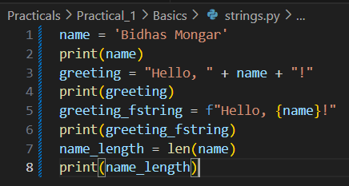

Practical Report 1 - CSF 101

Objective for the practical:

1. These Exercises are designed in such a way that it helps us (the students) to practice working with basic python terminologies and concepts, namely data types, control structures, file operations, data structures and operations (arithmentic....)
2. This also helps learn writing of algorithms, pseudocodes and flowcharts to help solve various questions. 

Instructions and Solutions 
1. Basics 
    1.1 Boolean 
    #1 Create two boolean variables namely is_student and is_employed and assign True or False Value to them.
    #2 Use the and operator to check if you are both a student and employed.
    #3 Use the or operator to check if you are either a student or employed.
    
    Solution:
    

    1.2 Numbers 
    #1 Create two varirables 'age' and 'Height' and asign your age and height as its value
    #2 Calculate your age and store it in a new variable called age_in_days
    #3 Divide your age by 7 and print the results

    Solution: 
    

    1.3 Strings
    #1 create a variable for your name and use string concatenation to create a greeting message
    #2 use f-string to create the same greeting message 
    #3 print the length of your name 

    solution:
    

2. Control Structures
    2.1 Loops 
    #1 Use for loop and while loop to print the following outcomes:
        a.print whole number ranging from 1 to 5 
        b.using while loop print the values from 1 to 5 in a decending order.
        c.print a multiplication table using nested loop 
        d.calculate the sum of values ranging from 1 to 11 with the use of for loop 
        e. Iterate through the a list of fruits with the use of for loop 
    solution: 
    
    
    2.2 Conditionals
    #1 Use basic if and else statements to generate following outcomes:
        a.Validate if the given number is positive number.
        b.generate a sample grading system. 
        c.Use Tenary operator to print simple evaluation if wheather the number is even or odd
        d. Generate a simple sample of calculator

    solution:
    
    

    2.3 Break and Continue
    